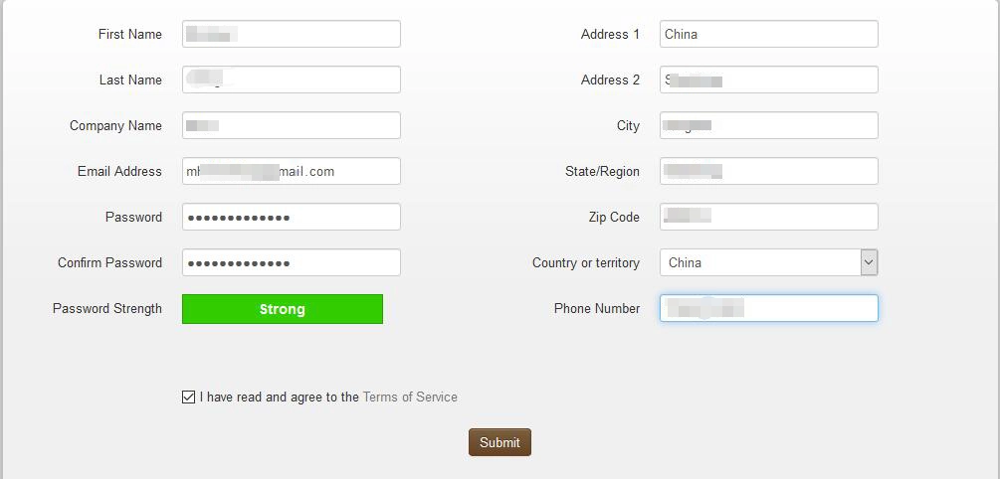
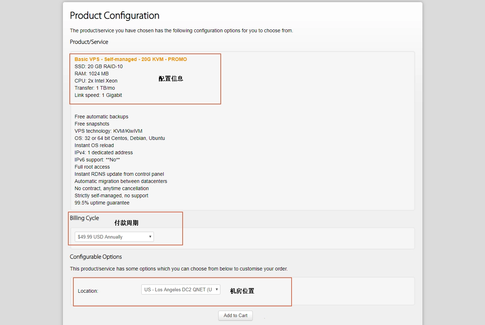
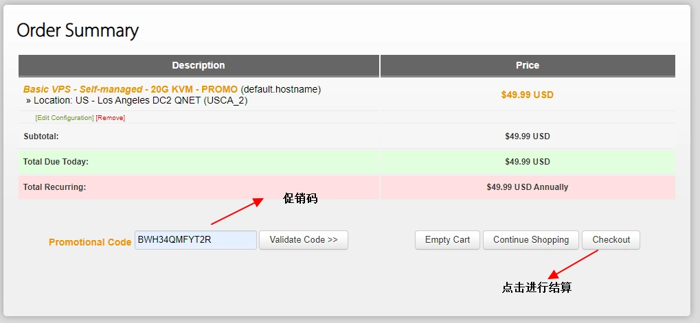
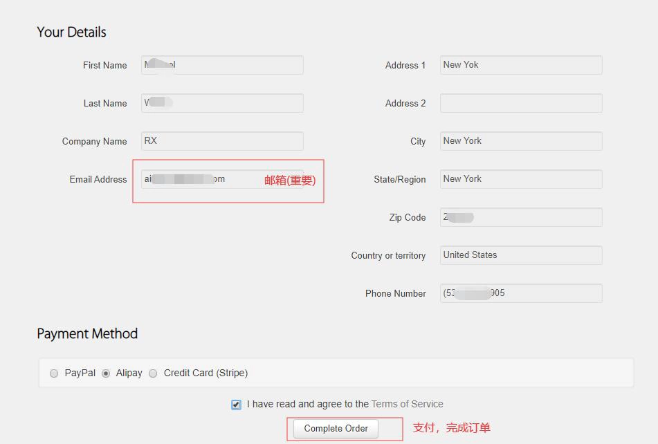
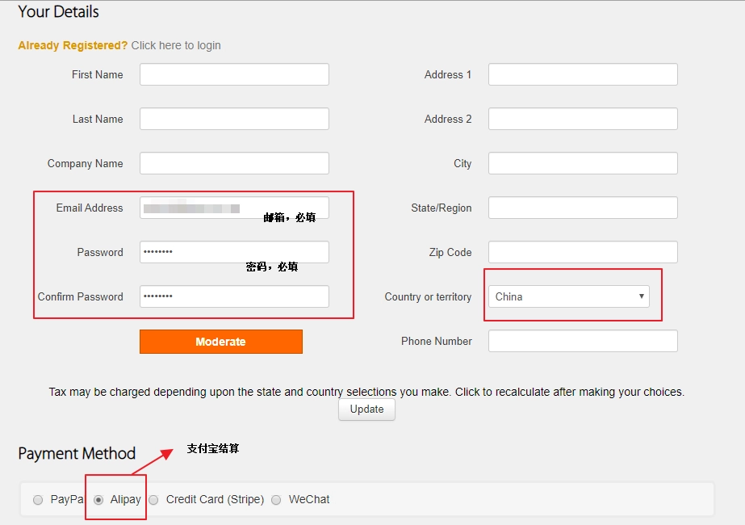
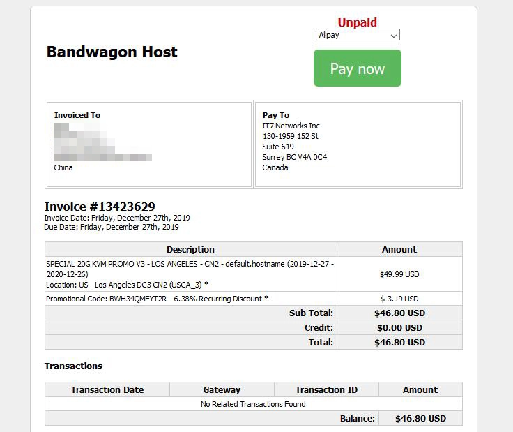
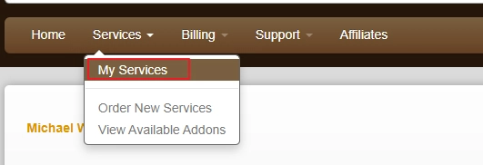
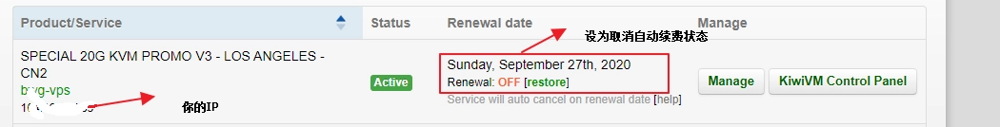
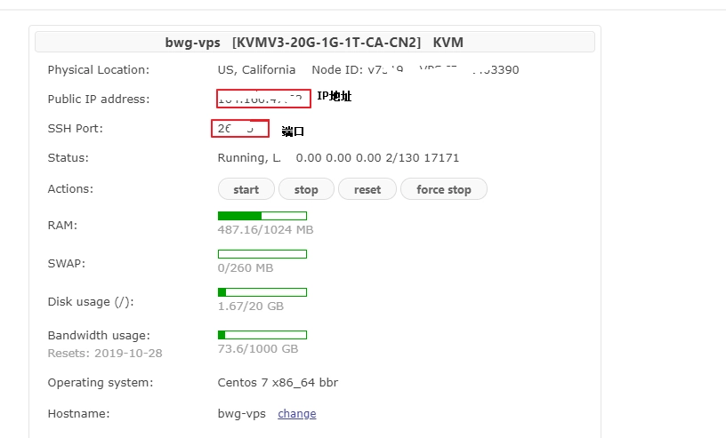
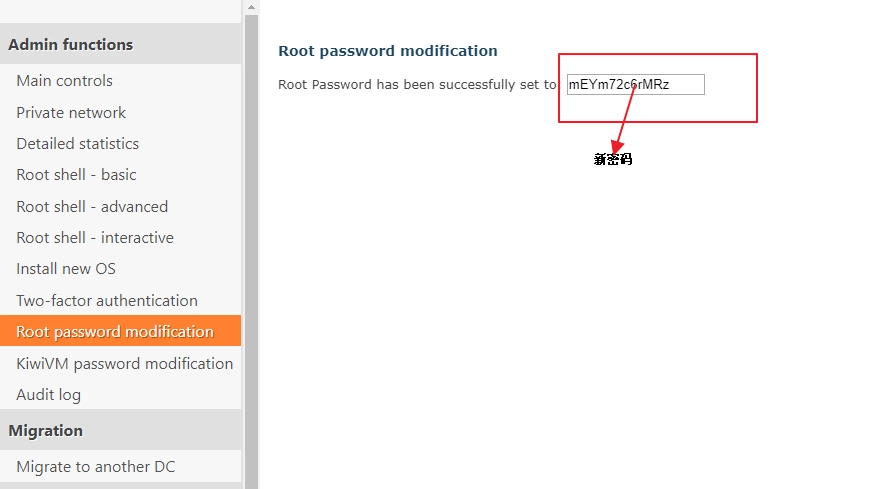

# 搬瓦工VPS注册购买完整指南：从零开始的实操教程

---

很多人第一次接触VPS服务器时，最大的困扰不是不知道选哪家，而是"注册购买这事儿，到底怎么操作才不会出错"。特别是面对全英文界面，担心填错信息、付款出问题、买完了不知道怎么用——这些顾虑很正常。

这篇文章就是把搬瓦工VPS的注册、购买、使用全流程拆解开来，用最直白的方式告诉你每一步该干什么。看完你就知道，其实整个过程比你想象的简单多了。

---

## 注册账号：第一次接触搬瓦工要做的事

打开浏览器（Chrome、Firefox都行），输入 [www.bandwagonhost.com](https://bandwagonhost.com/aff.php?aff=79616) 或者直接点击链接进入官网。进去之后，你会看到页面顶部有个"Register"按钮，点它。

点完"Register"会跳转到注册页面。这里需要填的东西不多：邮箱、密码、再确认一遍密码。邮箱务必填真实的，因为后面的登录信息、服务器密码都会发到这个邮箱里。密码建议设置得复杂一点，毕竟这关系到你服务器的安全。

填完基本信息后，下面会让你填地址、城市、国家这些。说实话，除了邮箱，其他信息随便写也没事——搬瓦工不会真的去核实你是不是住在那个地址。填完之后，勾选底部的"I have read and agree to the Terms of Service"（就是那个用户协议），然后点"Submit"提交。

提交成功后，你就自动登录了。接下来就是选套餐的环节。

---

## 选套餐：找到适合自己的配置

登录后，你可以去套餐页面看看有哪些方案。搬瓦工的套餐挺多的,配置从低到高都有。如果你是第一次用VPS，建议先选个入门级的试试水，后面不够用了再升级也来得及。

选好套餐后，点击"Add to Cart"把它加到购物车。这时候会跳转到购物车页面，长这样：

在这个页面上，有个"Promotional Code"的输入框。这里可以填优惠码——输入 BWH34QMFYT2R，然后点右边的"Validate Code"验证一下。优惠码生效后，价格会便宜一点。验证完就点"Checkout"进入结算页面。

---

## 付款：支付宝搞定一切

点了"Checkout"之后，会进入确认订单的页面。如果你前面已经注册过了，这里会直接显示你的个人信息，然后让你选支付方式。

如果你前面没注册，这个页面会先让你填个人信息完成注册，然后才能选支付方式。

不管哪种情况，选支付方式的时候记得选"Alipay"（支付宝）。选好之后点"Complete Order"，会跳转到订单明细页面。

确认一下支付方式是"Alipay"，然后点"Pay Now"。这时候会跳转到支付宝的付款页面，扫码或者登录支付宝付款就行了。付款成功后，你的VPS就激活了。

想要更稳定、更灵活的VPS服务体验？👉 [搬瓦工提供多机房可选、支持随时切换的高性价比方案](https://bandwagonhost.com/aff.php?aff=79616)，新手友好，老手也能玩得转。

---

## 使用VPS：拿到服务器信息后该干什么

付款完成后，回到用户中心。点击顶部菜单的"Services"，然后选"My Services"，你会看到自己购买的服务器列表。

在列表里找到你刚买的那台服务器，点击右侧的"KiwiVM Control Panel"进入控制面板。

控制面板里会显示服务器的IP地址、SSH端口号这些关键信息。密码的话，搬瓦工会发一封邮件到你注册时填的邮箱里，邮件标题一般是"New VPS Information"之类的，里面有root密码。

拿到IP、端口和密码之后，你就可以用XShell、Putty这些SSH工具远程连接服务器了。连上之后,服务器就归你折腾了——搭网站、搭代理、跑程序,随便你怎么玩。

---

## 忘记密码怎么办：控制面板直接重置

如果你忘了root密码，或者想换个更安全的密码，不用慌。回到KiwiVM控制面板，找到左侧菜单里的"Root password modification"，点进去就能重置密码。

点击"Generate and set new root password"，系统会自动生成一个新密码并显示出来。记得把新密码保存好，然后用新密码重新连接服务器就行了。

---

## 总结

整个流程走下来，其实就是：注册账号 → 选套餐 → 付款 → 拿到服务器信息 → 开始使用。搬瓦工的操作界面虽然是英文的，但逻辑很清晰，每一步该干什么都很明确。

如果你是第一次买VPS，搬瓦工确实是个不错的选择——👉 [价格透明、机房多、支持支付宝付款](https://bandwagonhost.com/aff.php?aff=79616)，遇到问题还能随时在控制面板里重装系统或者换机房，试错成本低。买完之后，剩下的就是慢慢摸索怎么用好这台服务器了。
